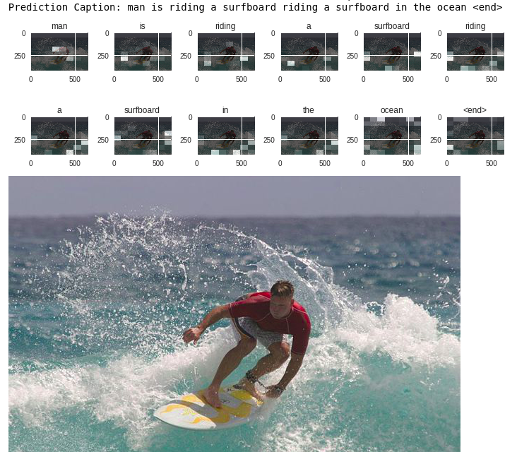

# Image-Captioning-with-Attention-Mechanism
This projects leverages the pretrained (Imagenet) InceptionV3 model and and CNN-Encoder-RNN-Decoder model with an attention mechanism to predict a caption for an image. This model was trained on MS-COCO dataset (30,000), for better results/predictions, full dataset can be used. It was made using TensorFlow-GPU 2.0.0.
 

